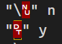
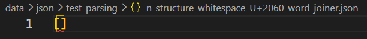
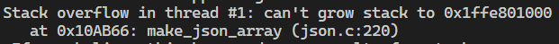

# cc 

## Network TCP C/S
1. TCP Server
   1. Blocking: 1Server-1Client
   2. NonBlocking: by linux-select
   3. NonBlocking: by linux-epoll
   4. IPv4
   5. MaxClientSize
   6. Read from clients, Write to clients

2. TCP Client
   1. Write to server, Read from server
   2. IPv4
   3. Client connect to clients by server dispatching

3. Features Append:
   1. server read/write, client read/write both in both sides.
   2. client-client connects in chat-room mode dispatched by server.
   3. IPv6 Nerwork.
   4. server give the avaliable ipv4 or ipv6 network addresses.

## CTRLIB (Container Library)
1. sequential: blist, bqueue, bstack, barray
2. associative: bstree, avltree, rbtree, bheap
3. multiple-associative: m-bst, m-avl, m-rb
4. ring, skiplist

## LIBJSON (Zero dependency JSON Library)
1. json encode
2. json decode
3. ctrlib/sbuf: safe string buffer
### weak performance decode optimization
#### weak dimension
1. memory huge
2. decode time 300' slower than gostd 
#### todo
1. json_object use array, not rb_tree
2. use pperf to opt core function
3. yyjson/test data to test correctness
4. analyse the profiling
#### ASK
1. how to recognize '\t' with ' ', '\n' with '', '\"' with '"', ...
2. how to recognize :
, 
,

3. invalid json: 
4. object or array exceeded maxdepth

## Debug
1. `gdb ./a.out -x a.gdbinit`
2. `valgrind --tool=memcheck --leak-check=full ./a.out`

## Test
### AVLTree VS SkipList
```bash
u@me:~/cc/cc$ time ./skiplist_test.d avl 10000000
test AVLTree
len=9976754, level=28

real    0m20.797s
user    0m20.317s
sys     0m0.480s
u@me:~/cc/cc$ time ./skiplist_test.d skiplist 10000000
test SkipList
len=9976776, level=12

real    0m27.256s
user    0m26.703s
sys     0m0.552s
```

### Golang Std code.json
performance is weak:
```
# ts
bssize = 7238262B
json decode time: 9262.6630ms
json encode time: 13.3800ms

# mem
total heap usage: 689,401 allocs, 689,401 frees, 6,294,328,569 bytes 
```